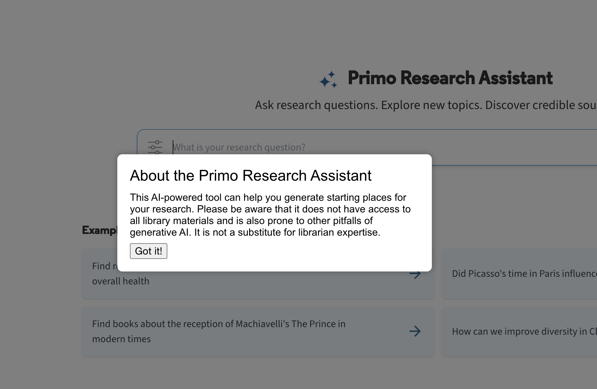

# primo-research-assistant-popup
Creates a popup window/modal with custom text when users navigate to the Primo Research Assistant.

A concern with Primo Research Assistant (Primo's AI chatbot) is that it only indexes CDI content. This may not be clear to users. 

This Primo VE customization creates a modal/popup when users visit the Research Assistant. The text of the modal can be customized within the `template` portion of the Angular module in custom.js.

